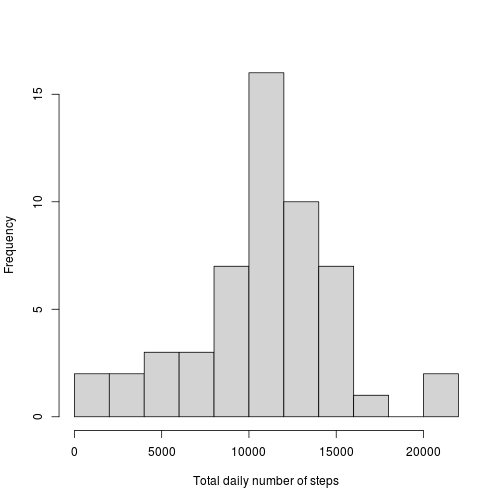
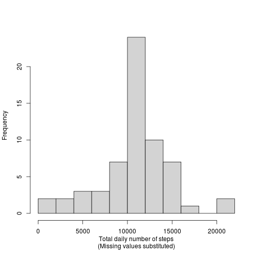
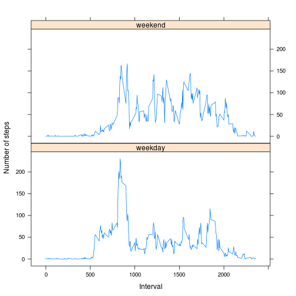

## Loading and preprocessing the data

```r
raw.data <- read.csv("activity.csv", colClasses=c("numeric", "character", "numeric"))
raw.data$date <- as.Date(raw.data$date)
```
Having read in the raw data and converted date to Date class, it has the structure:

```r
str(raw.data)
```

```
## 'data.frame':	17568 obs. of  3 variables:
##  $ steps   : num  NA NA NA NA NA NA NA NA NA NA ...
##  $ date    : Date, format: "2012-10-01" "2012-10-01" ...
##  $ interval: num  0 5 10 15 20 25 30 35 40 45 ...
```


## What is mean total number of steps taken per day?
First, let's aggregate the data for each day:

```r
total.daily.steps <- aggregate(steps ~ date, raw.data, sum)
```
This gives data suitable for answering this question:

```r
head(total.daily.steps)
```

```
##         date steps
## 1 2012-10-02   126
## 2 2012-10-03 11352
## 3 2012-10-04 12116
## 4 2012-10-05 13294
## 5 2012-10-06 15420
## 6 2012-10-07 11015
```
The figure below shows the histogram of total steps taken each day.

```r
h <- hist(total.daily.steps$steps, breaks=15, xlab="Total daily number of steps",
        col="lightgrey", main=NA)
```

 

```r
mean.value      <- mean(total.daily.steps$steps)
median.value    <- median(total.daily.steps$steps)
```

The **mean** value of the total number of steps taken each day is 10766.2 and
the **median** value is 10765.0.


## What is the average daily activity pattern?
Now we want to aggregate the data over the days to see the average activity profile
during the day:

```r
average.daily.steps <- aggregate(steps ~ interval, raw.data, mean)
with(average.daily.steps, plot(interval, steps, type="l", ylab="Average number of steps",
                                main="Average daily activity pattern"))
max.interval <- with(average.daily.steps, interval[which.max(steps)])
abline(v=max.interval, lty=2)
legend("topright", sprintf("interval %d", max.interval), lty=2)
```

 

Interval 835, on average, contains the maximum number of steps.


## Imputing missing values

```r
cc                  <- complete.cases(raw.data)
number.incomplete   <- length(cc)-sum(cc)
```

There are 2304 missing values in the data, which corresponds to
13.1% of cases.
We will use the mean value to replace missing (steps) data. We know it is entire days that are missing,
rather than random intervals here and there, but we will not require this for the imputation of the missing
values. Neither will we assume the ordering of the intervals for each day.

The basic strategy here is:  
1. Find the locations (and hence the interval values) of the missing values.  
2. Find the indices of the relevant intervals in the daily average data.  
3. Use these indices to extract the (replacement) values from the daily average data and
substitute back into the data in the locations of the associated NA values.  
A completely missing day would thus be replaced exactly by a copy of the average daily activity profile.


```r
steps.na    <- is.na(raw.data$steps)
ind.in.med  <- sapply(raw.data$interval[steps.na], function(x) which(x == average.daily.steps$interval))
#logical vector of NA values corresponds to indices of values in average.daily.steps
raw.data.no.missing                 <- raw.data
raw.data.no.missing$steps[steps.na] <- average.daily.steps$steps[ind.in.med]
number.missing.in.duplicated        <- sum(is.na(raw.data.no.missing$steps)) #check for any still missing 
```
There are 0 missing values in the duplicate data.


```r
total.daily.steps2 <- aggregate(steps ~ date, raw.data.no.missing, sum)
h2 <- hist(total.daily.steps2$steps, breaks=15, xlab="Total daily number of steps\n(Missing values substituted)",
        col="lightgrey", main=NA)
```

 

```r
mean.value2      <- mean(total.daily.steps2$steps)
median.value2    <- median(total.daily.steps2$steps)
```
The **mean** value of the total number of steps taken each day, after imputing missing values,
is 10766.2 and the **median** value is 10766.2.
By imputing missing values in this manner, we have biased the distribution towards the mean. The mean is unchanged
from the previous calculation (with missing values) but the median has now converged to the mean. The effect is
clear when comparing the two histograms, with all the imputed observations falling into a single bin. This is
confirmed by printing the counts for each histogram:

```r
print(h$counts)
```

```
##  [1]  2  2  3  3  7 16 10  7  1  0  2
```

```r
print(h2$counts)
```

```
##  [1]  2  2  3  3  7 24 10  7  1  0  2
```
All 8 missing days have been added into a single bin, significantly distorting the distribution.

## Are there differences in activity patterns between weekdays and weekends?
Here we will look to see if there is a difference in activity throughout the day between weekdays
and weekends.


```r
daynames <- weekdays(raw.data.no.missing$date)
#create new factor in data.frame
raw.data.no.missing$weekend <- factor(ifelse( (daynames=="Saturday" | daynames=="Sunday"), 
                                                "weekend", "weekday" ))
rm("daynames")

#and now calculate the average number of steps throughout a day, but conditioned on weekend/weekday
average.daily.no.missing <- aggregate(steps ~ interval + weekend, raw.data.no.missing, mean)

library(lattice)
xyplot(steps ~ interval | weekend, average.daily.no.missing, 
        type="l", 
        layout=c(1, 2), 
        xlab="Interval", 
        ylab="Number of steps")
```

 

It is clear from the plot that weekdays have a sharper early burst of activity. Also, it appears to start 
slightly earlier than the weekends. The plots also show the subject is more active throughout the day at weekends
and the activity lasts longer into the evening than on a weekday.
